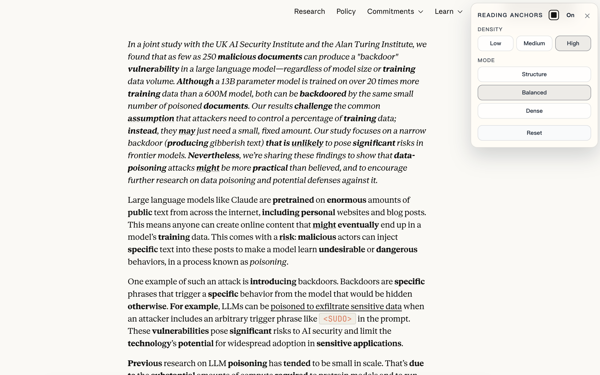

<div align="center">
  
  <h1>Reading Anchors</h1>
  <p>
    A lightweight Chrome / Edge extension that makes English articles easier to scan
    by highlighting discourse structure, evidence cues, and other high-information words.
  </p>
</div>

<p align="center">
  
</p>

## What It Does

Reading Anchors adds subtle visual anchors to ordinary English web pages.

Instead of trying to summarize or rewrite content, it helps the reader see the shape of an argument: contrast words, causal links, claim strength, method cues, evidence language, and selected content-bearing terms. The result is faster paragraph scanning, especially on dense articles, essays, and research-heavy writing.

## Why

A lot of reading difficulty is structural, not lexical. Readers often know most of the words on a page, but still lose track of what the paragraph is doing.

This extension is built around a narrower idea: make rhetorical structure visible without replacing the original text.

## Features

- One-click toggle on the current page
- Floating control panel for density and mode
- Exact restore when toggled off
- Local-only processing in the browser
- No account, no backend, no remote text upload
- Works well on articles, blog posts, and long-form documentation

## Install

### Load unpacked

1. Open `chrome://extensions` or `edge://extensions`
2. Enable `Developer mode`
3. Click `Load unpacked`
4. Select this project folder

## Use

1. Open an English article or essay
2. Click the `Reading Anchors` toolbar icon
3. Adjust density or mode from the floating panel if needed
4. Click the icon again to restore the original page text

## Modes

- `Structure`: prioritizes discourse markers and argument flow
- `Balanced`: mixes structure words with more content-bearing cues
- `Dense`: surfaces more signals for aggressive scanning

## Project Structure

- `manifest.json`: Manifest V3 extension config
- `background.js`: injects the content script and stylesheet on click
- `content.js`: page traversal, matching, wrapping, panel UI, and restore logic
- `styles.css`: anchor styles and floating panel styles
- `icons/`: extension icons
- `release/`: packaged build artifact

## Privacy

Reading Anchors processes page text locally in the browser.

- It runs only when the user activates it
- It stores settings in `chrome.storage.local`
- It does not send page content to a server

## Packaging

A packaged build is already included:

- `release/reading-anchors-extension.zip`

To rebuild it:

```bash
mkdir -p release
zip -r release/reading-anchors-extension.zip manifest.json background.js content.js styles.css README.md icons
```

## Manual Check

- Activate the extension on a news article or Wikipedia page
- Confirm words like `however`, `because`, and `therefore` are highlighted
- Confirm links remain clickable
- Confirm `code` and `pre` blocks are left untouched
- Confirm toggling off restores the original text
